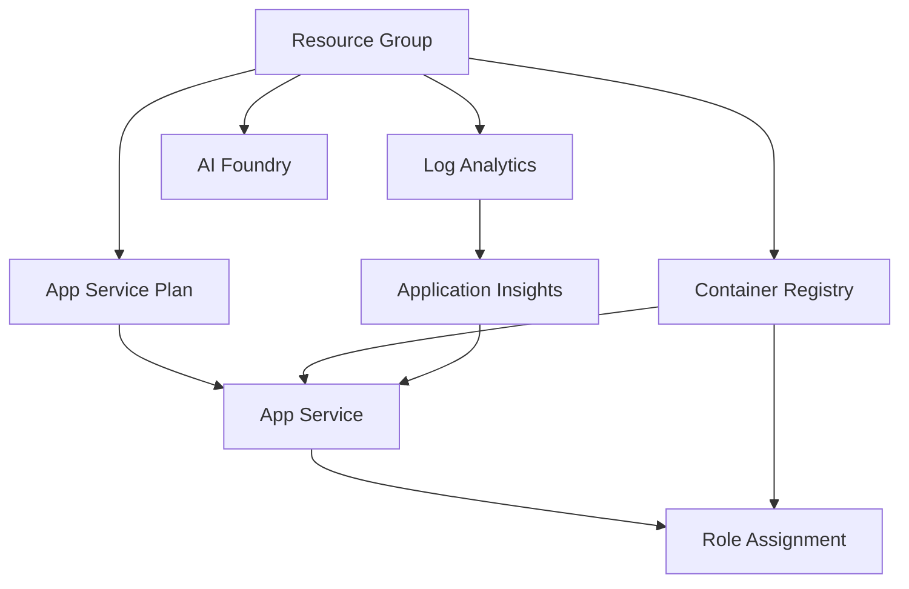

# Infrastructure Module Documentation

## Overview

This directory contains the Bicep infrastructure as code (IaC) for deploying ZavaStorefront to Azure.

## Module Architecture

### Entry Points

1. **main.bicep** (Subscription Scope)
   - Creates the resource group
   - Orchestrates the entire deployment
   - Outputs key resource information

2. **main.resources.bicep** (Resource Group Scope)
   - Deploys all Azure resources
   - Manages dependencies between resources
   - Configures resource relationships

3. **main.bicepparam** (Parameters File)
   - Defines environment-specific parameters
   - Reads from environment variables

## Modules

### Core Infrastructure

#### log-analytics.bicep
**Purpose**: Centralized logging and metrics collection

**Resources**:
- `Microsoft.OperationalInsights/workspaces`

**Key Properties**:
- SKU: PerGB2018 (pay-as-you-go)
- Retention: 30 days (configurable)
- Public access enabled for development

**Outputs**:
- Workspace ID
- Workspace name
- Customer ID

---

#### app-insights.bicep
**Purpose**: Application performance monitoring and telemetry

**Resources**:
- `Microsoft.Insights/components`

**Key Properties**:
- Type: Web application
- Workspace-based (connected to Log Analytics)
- Connection string for SDK integration

**Outputs**:
- Instrumentation key
- Connection string
- Resource ID

---

#### acr.bicep
**Purpose**: Container registry for Docker images

**Resources**:
- `Microsoft.ContainerRegistry/registries`

**Key Properties**:
- SKU: Basic (for dev; Standard/Premium for prod)
- Admin user disabled (RBAC only)
- Public network access enabled
- Azure Services bypass enabled

**Outputs**:
- Login server URL
- Registry name
- Resource ID

**Security Notes**:
- Admin credentials are disabled
- Access controlled via RBAC
- Uses managed identity for authentication

---

#### app-service-plan.bicep
**Purpose**: Compute resources for web application

**Resources**:
- `Microsoft.Web/serverfarms`

**Key Properties**:
- SKU: B1 (Basic tier)
- OS: Linux
- Reserved: true (required for Linux)

**Outputs**:
- Plan ID
- Plan name

**Scaling**:
- Dev: B1 (1 vCPU, 1.75 GB RAM)
- Test: S1 (1 vCPU, 1.75 GB RAM, staging slots)
- Prod: P1v2+ (2+ vCPU, 3.5+ GB RAM, auto-scale)

---

#### app-service.bicep
**Purpose**: Web application hosting using containers

**Resources**:
- `Microsoft.Web/sites`

**Key Properties**:
- Kind: Linux Container App
- Identity: System-assigned managed identity
- HTTPS only: Enforced
- Container source: Azure Container Registry
- ACR authentication: Managed Identity (no passwords)

**Configuration**:
- Docker registry: Uses ACR with managed identity
- Always On: Disabled for Basic tier
- HTTP 2.0: Enabled
- TLS: 1.2 minimum
- FTP: FTPS only

**Environment Variables**:
- `APPLICATIONINSIGHTS_CONNECTION_STRING`: Monitoring
- `DOCKER_REGISTRY_SERVER_URL`: ACR endpoint
- `ASPNETCORE_ENVIRONMENT`: Development

**Outputs**:
- App name
- Default hostname
- Managed identity principal ID

---

#### acr-role-assignment.bicep
**Purpose**: RBAC configuration for ACR access

**Resources**:
- `Microsoft.Authorization/roleAssignments`

**Key Properties**:
- Role: AcrPull (7f951dda-4ed3-4680-a7ca-43fe172d538d)
- Principal: App Service managed identity
- Scope: Container Registry

**Why This Matters**:
- Eliminates password-based authentication
- Follows Azure security best practices
- Enables automatic credential rotation
- Audit trail via Azure Activity Log

---

#### ai-foundry.bicep
**Purpose**: Azure AI Services (formerly Cognitive Services)

**Resources**:
- `Microsoft.CognitiveServices/accounts`

**Key Properties**:
- Kind: AIServices (multi-service)
- SKU: S0 (standard)
- Custom subdomain: Required for AI services
- Location: westus3 (GPT-4 and Phi available)

**Capabilities**:
- GPT-4 models
- Phi models
- Computer Vision
- Speech services
- Language understanding

**Outputs**:
- Endpoint URL
- API key
- Resource ID

## Deployment Flow

```
1. main.bicep (subscription)
   └─> Creates Resource Group
       └─> main.resources.bicep (resource group)
           ├─> log-analytics.bicep
           ├─> app-insights.bicep (depends on log-analytics)
           ├─> acr.bicep
           ├─> app-service-plan.bicep
           ├─> app-service.bicep (depends on plan, acr, app-insights)
           ├─> acr-role-assignment.bicep (depends on acr, app-service)
           └─> ai-foundry.bicep
```

## Resource Dependencies



## Naming Conventions

| Resource Type | Pattern | Example |
|---------------|---------|---------|
| Resource Group | `rg-{app}-{env}-{location}` | `rg-zavastore-dev-westus3` |
| ACR | `acr{app}{env}{suffix}` | `acrzavastoredev7k3m9` |
| App Service Plan | `asp-{app}-{env}` | `asp-zavastore-dev` |
| App Service | `app-{app}-{env}-{suffix}` | `app-zavastore-dev-7k3m9` |
| Log Analytics | `log-{app}-{env}` | `log-zavastore-dev` |
| App Insights | `appi-{app}-{env}` | `appi-zavastore-dev` |
| AI Foundry | `aif-{app}-{env}-{suffix}` | `aif-zavastore-dev-7k3m9` |

**Suffix**: `uniqueString(resourceGroup().id)` - ensures global uniqueness

## Parameters

### Required Parameters

| Parameter | Type | Description |
|-----------|------|-------------|
| `environmentName` | string | Environment identifier (dev, test, prod) |
| `location` | string | Azure region (default: westus3) |
| `baseName` | string | Base name for resources (default: zavastore) |

### Optional Parameters

| Parameter | Type | Description | Default |
|-----------|------|-------------|---------|
| `resourceGroupName` | string | Custom RG name | Generated from pattern |
| `retentionInDays` | int | Log Analytics retention | 30 |
| `acrSku` | string | ACR tier | Basic |
| `appServicePlanSku` | object | App Service tier | B1 |

## Environment Variables

Set these before deployment:

```powershell
# Azure Developer CLI
$env:AZURE_ENV_NAME = "dev"
$env:AZURE_LOCATION = "westus3"

# Or using azd
azd env set AZURE_ENV_NAME dev
azd env set AZURE_LOCATION westus3
```

## Bicep Best Practices Applied

### 1. Modular Design
- Each resource type in separate module
- Reusable modules with parameters
- Clear module interfaces (inputs/outputs)

### 2. Security
- No hardcoded secrets
- Managed identities over service principals
- RBAC over admin credentials
- HTTPS enforced
- Modern TLS versions only

### 3. Resource Types
- Using latest stable API versions
- User-defined types where appropriate
- Secure parameters for sensitive data

### 4. Naming
- Consistent naming conventions
- Resource-specific naming patterns
- Unique suffixes for global resources

### 5. Dependencies
- Explicit dependencies via `dependsOn`
- Symbolic references over resource IDs
- Parent-child relationships properly defined

### 6. Outputs
- Clear output naming
- Structured output objects
- Sensitive values marked with @secure()

## Testing

### Validation

```powershell
# Validate Bicep syntax
az bicep build --file infra/main.bicep

# What-if deployment
az deployment sub what-if `
  --location westus3 `
  --template-file infra/main.bicep `
  --parameters infra/main.bicepparam
```

### Deployment

```powershell
# Deploy to dev
az deployment sub create `
  --location westus3 `
  --template-file infra/main.bicep `
  --parameters infra/main.bicepparam `
  --name zavastore-dev-$(Get-Date -Format "yyyyMMddHHmmss")
```

## Troubleshooting

### Common Issues

**Issue**: Deployment fails with "name already exists"
- **Cause**: Global resource name conflict
- **Solution**: Delete existing resource or change `baseName` parameter

**Issue**: Role assignment fails
- **Cause**: Azure AD propagation delay
- **Solution**: Wait 1-2 minutes and retry

**Issue**: App Service can't pull from ACR
- **Cause**: Role assignment not yet effective
- **Solution**: Restart app service after 2-3 minutes

**Issue**: AI Foundry quota exceeded
- **Cause**: Regional or subscription limits
- **Solution**: Request quota increase or use different region

## Production Considerations

### Changes for Production

1. **SKU Upgrades**:
   - ACR: Standard or Premium
   - App Service: P1v2 or higher
   - AI Foundry: Based on usage patterns

2. **Security Enhancements**:
   - Private endpoints for ACR
   - VNet integration for App Service
   - Azure Key Vault for secrets
   - Azure Front Door or App Gateway

3. **High Availability**:
   - Multi-region deployment
   - Traffic Manager or Front Door
   - Zone redundancy
   - Auto-scaling rules

4. **Monitoring**:
   - Custom alerts and dashboards
   - Log retention increase
   - Diagnostic settings for all resources
   - Azure Monitor workbooks

5. **Backup & DR**:
   - ACR geo-replication
   - App Service backup configuration
   - Database backups (if added)
   - Disaster recovery plan

## Cost Optimization

### Development
- Basic/Standard SKUs
- Minimal retention periods
- Single region deployment
- Stop/deallocate when not in use

### Production
- Reserved Instances (1-3 year commitment)
- Auto-scaling based on demand
- Azure Hybrid Benefit (if applicable)
- Cost alerts and budgets

## Additional Resources

- [Bicep Documentation](https://learn.microsoft.com/azure/azure-resource-manager/bicep/)
- [Azure Resource Reference](https://learn.microsoft.com/azure/templates/)
- [App Service Best Practices](https://learn.microsoft.com/azure/app-service/app-service-best-practices)
- [ACR Best Practices](https://learn.microsoft.com/azure/container-registry/container-registry-best-practices)
